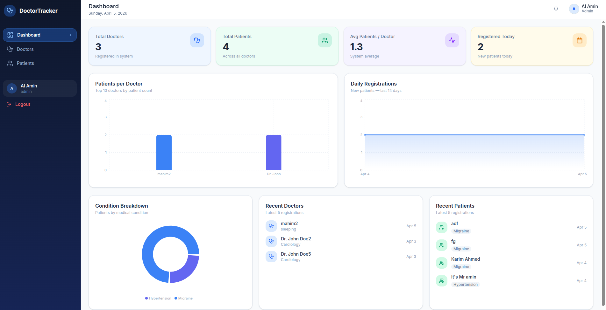
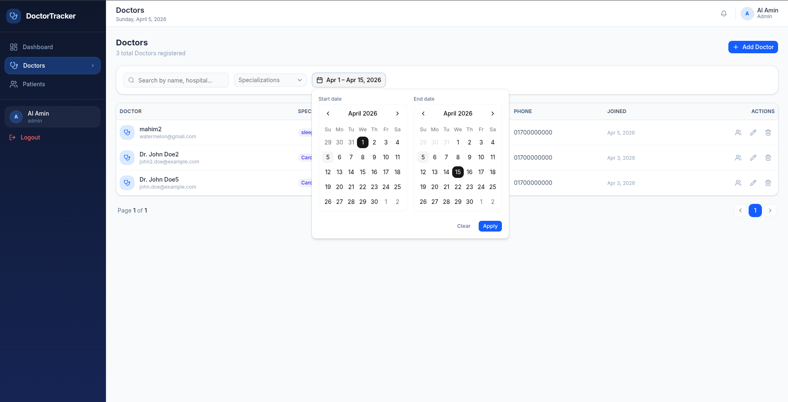
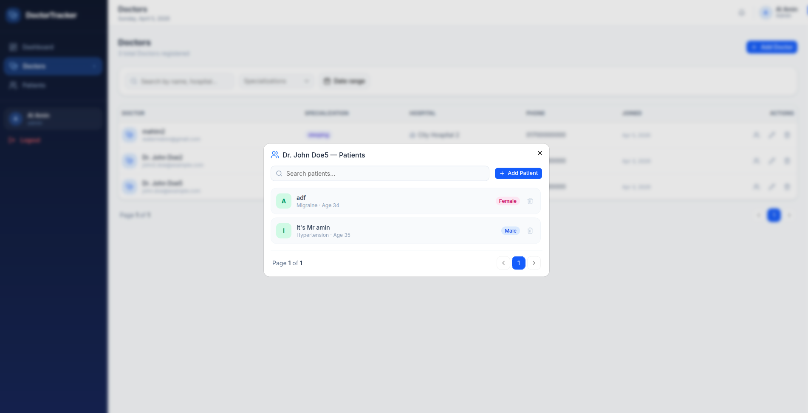
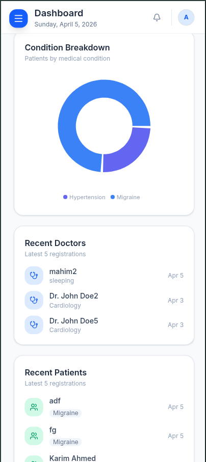
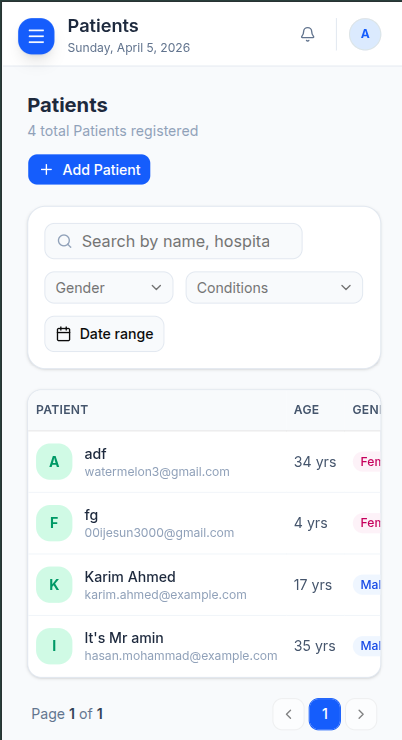
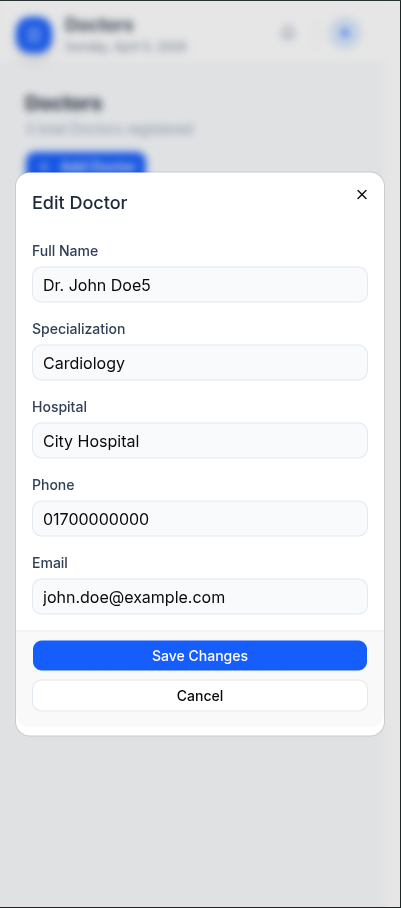

# Doctor Tracker

## A Secure full-stack project that manage doctors and their patients. A real Time Dashboard, advanced search/filter/pagination, JWT-based authentication with httpOnly cookies, and a clean modular backend architecture — all within a single Next.js application.

## Setup Guide

### Prerequisites

- Node.js 18+
- MongoDB (local or Atlas)

### Installation

```bash
git clone https://github.com/your-repo/doctor-tracker.git
cd doctor-tracker
npm install
```

Copy the example env file and fill in your values:

```bash
cp .env.example .env.local
```

Install shadcn/ui components:

```bash
npx shadcn@latest init
npx shadcn@latest add button input label card badge select table dialog alert-dialog avatar skeleton popover calendar sonner
```

Run the dev server:

```bash
npm run dev
```

Open [http://localhost:3000](http://localhost:3000).

### First-time Setup

First Register then Login, http://localhost:3000/register

---

## System Architecture

```
Browser (Next.js App Router)
    │
    ├── Redux Store (RTK Query) ──► /api/* (Next.js Route Handlers)
    │                                        │
    │                               modules/*/controller.ts
    │                                        │
    │                               modules/*/service.ts
    │                                        │
    │                               Mongoose Models ──► MongoDB
    │
    └── httpOnly Cookies (JWT) ──► auth middleware on every API route
```

**Data flow:** UI dispatches RTK Query → API route handler → module controller → service with QueryBuilder → MongoDB → serialized response → Redux cache → React component re-render.

---

## Technical Decisions

### 1. Redux over Context API

If Project small we can chose Context api. but the task say "Scalability considerations" thats why we chose redux. it help management complex state interactions across multiple components (auth state, API cache, form states). I can always store and selectors data easily. It has time-travel debugging with Redux DevTools and caching system with deep copy.

### 2. Soft Delete over Hard Delete

Both DoctorModel and PatientModel has isDeleted. if i delete the documents we can't has deleted doctor's historical patient records remain queryable for audit/reporting — and makes accidental deletions recoverable without a separate audit log table. When i fetch i insure it that find aggregation findOne documentsCount all the method when it query it always give not deleted data.

`For Scalability considerations i design Architecture in modular pattern. Use like catchAsynce, sendResponce, QueryBuilder, errorHandler etc utilis.`

---

## Visual Evidence

_(desktop screenshots here after running the app)_
this is dashboard  


this is doctor list  


this is doctor assign pathient  


_(mobile screenshots here after running the app)_





---

## Environment Variables

| Variable                 | Description               |
| ------------------------ | ------------------------- |
| `DATABASE_URL`           | MongoDB connection string |
| `JWT_ACCESS_TOKEN`       | Access token secret       |
| `JWT_REFRESH_TOKEN`      | Refresh token secret      |
| `JWT_ACCESS_EXPIRES_IN`  | e.g. `1d`                 |
| `JWT_REFRESH_EXPIRES_IN` | e.g. `7d`                 |
| `BCRYPT_SALT_ROUNDS`     | e.g. `12`                 |
